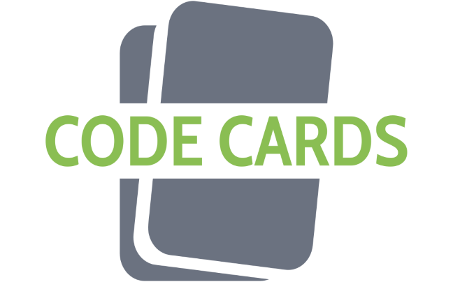

## Code Cards Home

  

     
Code Cards is a comprehensive online platform designed to help students study and improve their knowledge in a wide range of school subjects. Our platform utilizes an innovative approach to learning by incorporating flashcards and quizzes to make studying easier and more engaging.

We believe that traditional methods of studying can be boring and ineffective, which is why we have created a dynamic and interactive platform that makes learning fun and engaging. Our flashcards are designed to be visually appealing, with easy-to-read information presented in an organized and concise manner. They are an effective tool for memorizing and retaining information, and can be used to supplement any existing study material.

In addition to flashcards, our platform also includes quizzes to test students’ knowledge and understanding of various subjects. The quizzes are designed to be challenging but not overwhelming, and provide instant feedback to help students gauge their performance. Furthermore, our platform also provides statistics and insights into students’ performance, so they can see where they need to improve and track their progress over time.

  

  

    
  

  

    
Our platform is user-friendly and accessible, with a clean and intuitive design that makes it easy for students to navigate. It is also highly customizable, allowing students to choose the subjects and topics they want to study, and to create their own flashcards and quizzes if they so choose.

Code Cards is more than just a study tool, it’s a community where students can connect with each other, share their own flashcards and quizzes, and collaborate on projects. Our platform encourages students to work together and help each other, fostering a positive and supportive learning environment.

In conclusion, Code Cards is a revolutionary platform that is changing the way students study and learn. With its combination of flashcards, quizzes, and performance tracking, students have all the tools they need to succeed and achieve their academic goals. Join our community today and experience the benefits of a more interactive and engaging way of learning!

  

| Name | Github Profile | Role |
| :---- | :---- | :---- |
| Andrew Meng | [@supermengman](https://github.com/supermengman) | Backend Developer |
| Nicolas Mounier | [@nicm2](https://github.com/nicm2) | Scrum Master|
| Bailey Say | [@horizon-ab](https://github.com/horizon-ab) | Frontend Developer |
| Rohan Juneja | [@rjawesome](https://github.com/rjawesome) | Deployment |
| Aarav Arora | [@aaravarora01](https://github.com/aaravarora01) | Backend Developer |